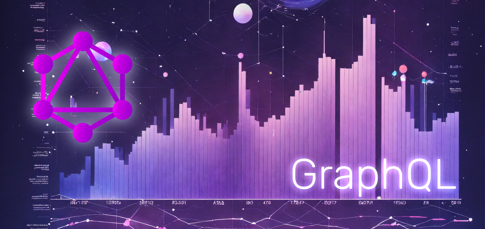

  

<a href="https://web.dio.me/articles/praticas-recomendadas-para-monitoramento-e-logging-de-apis-graphql-em-nodejs?back=%2Farticles&open-modal=true&page=1&order=oldest" title="View Article now"> 📕Clique aqui para ler o artigo na DIO</a>

<a href="https://medium.com/@crafht/práticas-recomendadas-para-monitoramento-e-logging-de-apis-graphql-em-node-js-19dfa4d8e242" title="View Article now"> 📕Clique aqui para ler o artigo no Medium</a>

## 💻 Tecnologias utilizadas no projeto

- [ChatGPT](https://chat.openai.com/) - para título e conteúdo
- [Lexica.art](https://lexica.art/) - para gerar imagens
- [Google Docs](https://docs.google.com) - Para construção do documento

## 📄 Prompts e ferramentas

ChatGPT：

|   Ação   | prompt                                                                                                                                                                                                                                                                         |
| :------: | ------------------------------------------------------------------------------------------------------------------------------------------------------------------------------------------------------------------------------------------------------------------------------ |
|  título  | Crie títulos sobre tecnicas de boas práticas para graphql em node js com typescript                                                                                                                                                                                                |
| conteúdo | Comporte-se como um escritor de artigos Sênior Tech backend e escreva um artigo seguindo as regras abaixo{REGRAS} Utilize o título: Práticas Recomendadas para Monitoramento e Logging de APIs GraphQL em Node.js No máximo 6 linhas por bloco de explicação Explique de maneira informal como se eu fosse para um Dev Junior Os blocos que serão criados estão abaixo: A importância do Monitoramento e Logging, Diferença entre Monitoramento e Logging, Call to action para minhas redes sociais, Adicione 5 Hashtaps que façam sentido com o artigo

Lexica.art：

- No léxica utilizamos o acervo público de imagens geradas por outras pessoas, os termos de pesquisa que utilizei durante a gravação do conteúdo foram:

• GraphQL
• Logging

Não econtrou nada relacionado, mas foi encontrado similar a grafos e logging

## ✨ Features

- Conteúdo criado manualmente com o apoio do ChatGPT
- Imagens do acervo público geradas via Lexica.art

#

## 👨‍💻 Expert

    
    <h3>&nbsp&nbsp&nbspKevin Santana </h3>
    
&nbsp&nbsp&nbsp
    <a href="https://github.com/zekdtonik">
    GitHub</a>&nbsp;|&nbsp;
    <a href="www.linkedin.com/in/kevin-fms">LinkedIn</a>
&nbsp;|&nbsp;
    <a href="https://www.instagram.com/keu_marxs/">
    Instagram</a>
&nbsp;&nbsp;

  

---

Criado por [Kevin Santana](https://github.com/zekdtonik) 💻💻